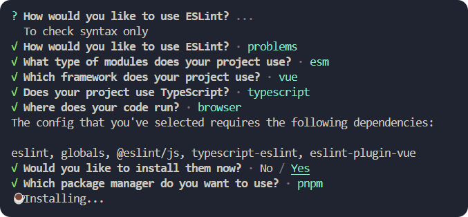
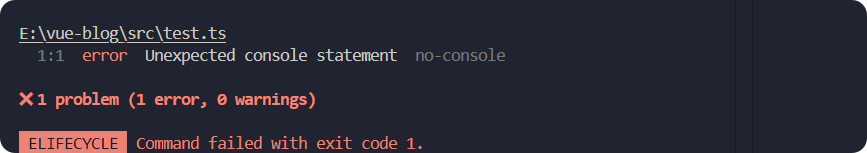
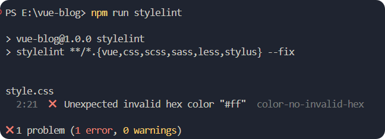
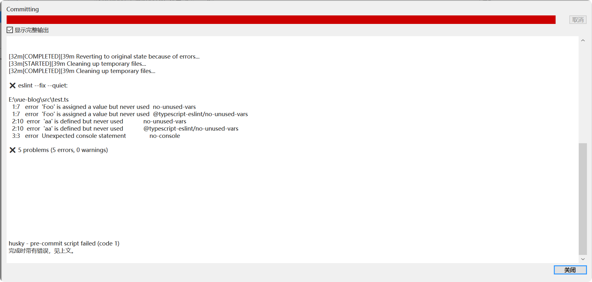
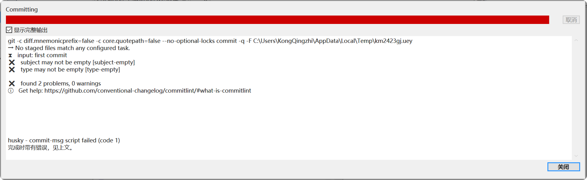

# 前端项目工程规范

## 前言

在现代前端开发过程中，团队协作已成为常态，多个成员共同参与同一个大型项目的开发与维护。然而，随着团队规模的扩大，一个显著的问题逐渐浮现——开发规范的缺失。每个开发者都有自己的代码书写习惯和风格，这导致了代码风格的不一致。更糟糕的是，提交代码时的提交日志也常常缺乏统一的标准，随意性很大。这些问题不仅影响了代码的可读性和可维护性，还在后续的开发和维护过程中增加了不少困难。因此，建立一套统一的开发规范和约束机制变得尤为重要。

为了应对这一挑战，本文介绍了一个基于 `vite` 的项目配置方案。通过集成 `eslint`、`prettier`、`style-lint`、`lint-staged`、`husky` 和 `commitlint` 等工具，我们能够有效地规范代码风格，确保提交日志的质量，并自动化执行一些常规的代码检查任务。这些工具的组合使用，不仅有助于提升代码质量，还能促进团队成员之间的协作，减少因个人习惯差异带来的问题，从而提高整个项目的开发效率和稳定性。

## eslint

### 为什么？

使用 `eslint` 的原因可以总结为以下几点：

- **代码质量保证**：`eslint` 能够静态分析代码，检测潜在的错误和不符合最佳实践的代码段，帮助开发者提前发现并修复问题，提高代码质量。

- **编码规范统一**：
  通过配置 `eslint` 规则，可以强制团队成员遵循统一的编码规范，减少因个人编码习惯不同而产生的代码风格差异，增强代码的一致性和可读性。

- **提高开发效率**：
  自动化的代码检查减少了人工审查的时间和精力，使开发者能够更快地定位和解决问题，加速开发流程。

- **易于扩展和定制**：
  `eslint` 提供了大量的内置规则，并支持自定义规则，可以根据项目的具体需求进行灵活配置，满足不同场景下的编码规范要求。

- **社区支持广泛**：
  `eslint` 拥有活跃的社区和丰富的插件生态，可以轻松集成到各种开发环境中，获取最新的编码规范和最佳实践。

综上所述，`eslint` 是一个强大的工具，能够有效提升前端项目的开发质量和团队协作效率。

### 是什么？

[`eslint`](https://eslint.org/) 是一个用于识别和报告 JavaScript 代码中模式问题的工具，旨在帮助开发者编写更高质量的代码。以下是 `eslint` 的一些关键特点和功能：

- **静态代码分析**：
  `eslint` 可以在不运行代码的情况下，通过静态分析来检测代码中的潜在错误和不符合最佳实践的部分。

- **编码规范**：
  它允许开发者定义和强制执行特定的编码规范，确保团队成员遵循一致的代码风格和最佳实践。

- **可配置性**：
  `eslint` 提供了丰富的内置规则，并且支持自定义规则，可以根据项目的需求进行灵活配置。

- **插件和共享配置**：
  `eslint` 拥有广泛的插件生态系统，可以轻松集成各种额外的功能，如支持不同的框架和库。
  同时，它还支持共享配置，方便团队快速应用一致的编码规范。

- **自动化集成**：
  `eslint` 可以与多种开发工具和构建系统（如 Webpack、Gulp、Grunt 等）集成，实现代码检查的自动化。

- **社区支持**：
  `eslint` 拥有一个活跃的开源社区，提供了大量的文档、教程和最佳实践，帮助开发者更好地使用和扩展 `eslint`。

总之，`eslint` 是一个非常强大的工具，能够帮助开发者提高代码质量，减少错误，增强代码的可读性和可维护性，是现代前端开发中不可或缺的一部分。

### 如何使用？

#### 安装

> [!NOTE]
> 要使用 ESLint，您必须安装 Node.js（版本 ^18.18.0、^20.9.0 或 >=21.1.0）并且需要带有 SSL 支持。（如果您使用的是官方的 Node.js 发行版，SSL 总是内置的。）。

```bash
npm init @eslint/config@latest

# or

yarn create @eslint/config

# or

pnpm create @eslint/config@latest
```

你需要回答一些问题，比如你的项目使用哪种 JavaScript 语法，你希望使用哪种风格指南，以及你想要的规则。



回答完毕后稍等片刻等待自动安装，依赖安装完成后会在你的项目根目录下会自动生成一个名为 `eslint.config.js` 的配置文件。

::: code-group

```js [eslint.config.js]
// 导入全局变量配置
import globals from 'globals';
// 导入JavaScript相关的ESLint插件
import pluginJs from '@eslint/js';
// 导入TypeScript相关的ESLint插件
import tseslint from 'typescript-eslint';
// 导入Vue.js相关的ESLint插件
import pluginVue from 'eslint-plugin-vue';

/**
 * ESLint配置数组，用于定义代码检查规则
 * @type {import('eslint').Linter.Config[]}
 */
export default [
  // 应用TypeScript ESLint推荐的规则配置
  ...tseslint.configs.recommended,

  // 应用Vue.js ESLint推荐的规则配置
  ...pluginVue.configs['flat/essential'],

  // 应用JavaScript ESLint推荐的规则配置
  pluginJs.configs.recommended,

  // 定义文件匹配模式，仅对指定的文件类型应用以下规则
  { files: ['**/*.{js,mjs,cjs,ts,vue}'] },

  // 配置全局变量，使用浏览器环境的全局变量
  { languageOptions: { globals: globals.browser } },

  // 对Vue文件进行特殊配置，使用TypeScript解析器
  {
    files: ['**/*.vue'],
    languageOptions: { parserOptions: { parser: tseslint.parser } },
  },
];
```

:::

### 忽略文件

在项目中有一些文件不需要进行代码检查，例如 `node_modules`、`.git` 等。我们可以在 `eslint.config.js` 文件中，使用 [ignores](https://eslint.org/docs/latest/use/configure/ignore#ignoring-files) 配置忽略这些文件。

::: code-group

```js [eslint.config.js] {24-25}
// 导入全局变量配置
import globals from 'globals';
// 导入JavaScript相关的ESLint插件
import pluginJs from '@eslint/js';
// 导入TypeScript相关的ESLint插件
import tseslint from 'typescript-eslint';
// 导入Vue.js相关的ESLint插件
import pluginVue from 'eslint-plugin-vue';

/**
 * ESLint配置数组，用于定义代码检查规则
 * @type {import('eslint').Linter.Config[]}
 */
export default [
  // 应用TypeScript ESLint推荐的规则配置
  ...tseslint.configs.recommended,

  // 应用Vue.js ESLint推荐的规则配置
  ...pluginVue.configs['flat/essential'],

  // 应用JavaScript ESLint推荐的规则配置
  pluginJs.configs.recommended,

  // 配置忽略项，指定在某些操作或任务中不应被处理的目录或文件
  { ignores: ['dist/**', 'node_modules/**'] },

  // 定义文件匹配模式，仅对指定的文件类型应用以下规则
  {
    files: ['**/*.{js,mjs,cjs,ts,vue}'],
    rules: {
      // 禁止使用console.*方法
      'no-console': 'error',
    },
  },

  // 配置全局变量，使用浏览器环境的全局变量
  { languageOptions: { globals: globals.browser } },

  // 对Vue文件进行特殊配置，使用TypeScript解析器
  {
    files: ['**/*.vue'],
    languageOptions: { parserOptions: { parser: tseslint.parser } },
  },
];
```

:::

### 使用

在 `package.json` 中添加如下脚本：

::: code-group

```json [package.json] {4-8}
{
  ...
  "scripts": {
    // 使用 ESLint 规则检查和自动修复 src 目录下及其子目录中的 JavaScript 和 TypeScript 文件
    // 包括 .vue, .js, .jsx, .cjs, .mjs, .ts, .tsx, .cts, .mts 文件类型
    // --fix 参数表示自动修复发现的代码问题
    // --debug 参数用于启动调试模式，输出更多调试信息
    "eslint": "eslint src/**/*.{vue,js,jsx,cjs,mjs,ts,tsx,cts,mts} --fix --debug"
  }

}
```

:::

### 测试

在 `eslint.config.js` 中新增一个规则。

::: code-group

```js [eslint.config.js] {27-30}
// 导入全局变量配置
import globals from 'globals';
// 导入JavaScript相关的ESLint插件
import pluginJs from '@eslint/js';
// 导入TypeScript相关的ESLint插件
import tseslint from 'typescript-eslint';
// 导入Vue.js相关的ESLint插件
import pluginVue from 'eslint-plugin-vue';

/**
 * ESLint配置数组，用于定义代码检查规则
 * @type {import('eslint').Linter.Config[]}
 */
export default [
  // 应用TypeScript ESLint推荐的规则配置
  ...tseslint.configs.recommended,

  // 应用Vue.js ESLint推荐的规则配置
  ...pluginVue.configs['flat/essential'],

  // 应用JavaScript ESLint推荐的规则配置
  pluginJs.configs.recommended,

  // 定义文件匹配模式，仅对指定的文件类型应用以下规则
  {
    files: ['**/*.{js,mjs,cjs,ts,vue}'],
    rules: {
      // 禁止使用console.*方法
      'no-console': 'error',
    },
  },

  // 配置全局变量，使用浏览器环境的全局变量
  { languageOptions: { globals: globals.browser } },

  // 对Vue文件进行特殊配置，使用TypeScript解析器
  {
    files: ['**/*.vue'],
    languageOptions: { parserOptions: { parser: tseslint.parser } },
  },
];
```

:::

在 `src` 目录下新建一个测试名为 `test.ts` 的文件，并添加如下代码：

::: code-group

```ts [test.ts]
console.log('hello world');
```

:::

执行 `npm run eslint` 命令，此时应该会看到如下报错信息：



ESLint 的报错信息表明了 `test.ts` 文件中存在一个 `console.log` 方法调用，而该方法被禁止使用。

## [Prettier](https://prettier.io/)

### 为什么？

Prettier 是一个代码格式化工具，它通过自动格式化代码来帮助开发团队保持代码风格的一致性。以下是使用 Prettier 的几个主要原因：

- **提高代码可读性**：
  Prettier 可以自动调整代码的缩进、空格、换行等，使得代码更加整洁和易读。

- **减少代码审查中的争论**：
  由于 Prettier 自动处理代码格式，团队成员可以将更多精力集中在代码逻辑上，而不是代码风格上。

- **易于集成**：Prettier
  可以轻松地与大多数编辑器和构建工具集成，如 VSCode、WebStorm、Webpack 等。

- **支持多种语言**：
  Prettier 支持多种编程语言，包括 JavaScript、TypeScript、CSS、HTML、JSON、Markdown 等。

- **节省时间**：
  手动格式化代码既耗时又容易出错，Prettier 可以自动完成这项工作，让开发者更专注于编写业务逻辑。

### 是什么？

Prettier 是一个意见化的代码格式化工具，旨在通过自动格式化代码来帮助开发团队保持一致的代码风格。它的主要特点包括：

- **自动格式化**：
  Prettier 可以自动调整代码的缩进、空格、换行等，确保代码风格统一。

- **减少代码审查中的争论**：由于代码格式由工具自动处理，团队成员可以将更多精力集中在代码逻辑和功能上。

- **易于集成**：
  Prettier 可以轻松地与大多数编辑器和构建工具集成，如 VSCode、WebStorm、Webpack 等。

- **支持多种语言**：
  Prettier 支持多种编程语言，包括 JavaScript、TypeScript、CSS、HTML、JSON、Markdown 等。

- **配置简单**：
  Prettier 提供了一些基本的配置选项，但默认情况下已经能够满足大多数需求。

- **社区支持**：
  Prettier 拥有活跃的社区和丰富的插件生态，可以满足各种特定需求。

通过使用 Prettier，开发者可以节省大量时间，提高代码质量和团队协作效率。

### 安装

```bash
npm install --save-dev --save-exact prettier

# or

yarn add --dev --exact prettier

# or

pnpm add --save-dev --save-exact prettier
```

### 忽略的文件

在项目根目录创建一个 `.prettierignore` 文件，并添加如下内容：

::: code-group

```txt [.prettierignore]
**/.git
**/node_modules
**/dist
**/public
```

:::

### 配置

在项目根目录创建一个 `prettier.config.js` 文件，并添加如下内容：

::: code-group

```js [prettier.config.js]
export default {
  // 指定格式化代码中尾随逗号的样式
  // "es5" 表示仅在对象字面量和数组中添加尾随逗号，兼容 ES5 语法
  trailingComma: 'es5',

  // 设置制表符的空格数
  // 这里设置为 2 个空格
  tabWidth: 2,

  // 确定是否在语句末尾添加分号
  // 设置为 true 表示添加分号
  semi: true,

  // 确定字符串使用单引号还是双引号
  // 设置为 true 表示使用单引号
  singleQuote: true,
};
```

:::

### 使用

在 `package.json` 中添加如下脚本：

::: code-group

```json [package.json] {4-5}
{
  ...
  "scripts": {
    // 使用prettier格式化项目中的所有文件
    "prettier": "prettier . --write"
  }
}
```

:::

### 测试

在 `src` 目录下新建一个测试名为 `test.ts` 的文件，并添加如下代码：

::: code-group

```ts [test.ts]
console.log('hello world');
```

:::

执行 `npm run prettier` 命令，由于我们配置了在添加分号的规则，在执行完毕之后，会自动添加分号，`test.ts` 文件应该被修改为如下内容：

::: code-group

```ts [test.ts]
console.log('hello world');
```

:::

### 解决 eslint 和 prettier 冲突

#### 原因

- **规则重叠**：
  ESLint 和 Prettier 都可以处理代码格式化，但它们的规则可能会有重叠，导致格式化结果不一致。
- **配置冲突**：
  如果 ESLint 和 Prettier 的配置文件中存在相互矛盾的规则，会导致代码格式化时出现冲突。

#### 解决方法

解决这个问题的关键是找到一个合适的代码格式化工具，使得它既满足 ESLint 的要求，又满足 Prettier 的要求。

- **安装 [eslint-config-prettier](https://github.com/prettier/eslint-config-prettier#installation)**：

  - `eslint-config-prettier` 是一个 ESLint 插件，用于禁用与 Prettier 冲突的 ESLint 规则。
  - 安装命令：

    ```bash
    npm install eslint-config-prettier --save-dev
    ```

  - 在 ESLint 配置文件中添加 `eslint-config-prettier` 作为最后一个扩展：

    ::: code-group

    ```js [eslint.config.js] {9-10,26-27}
    // 导入全局变量配置
    import globals from 'globals';
    // 导入JavaScript相关的ESLint插件
    import pluginJs from '@eslint/js';
    // 导入TypeScript相关的ESLint插件
    import tseslint from 'typescript-eslint';
    // 导入Vue.js相关的ESLint插件
    import pluginVue from 'eslint-plugin-vue';
    // 导入eslint配置项以配合Prettier使用
    import eslintConfigPrettier from 'eslint-config-prettier';

    /**
     * ESLint配置数组，用于定义代码检查规则
     * @type {import('eslint').Linter.Config[]}
     */
    export default [
      // 应用TypeScript ESLint推荐的规则配置
      ...tseslint.configs.recommended,

      // 应用Vue.js ESLint推荐的规则配置
      ...pluginVue.configs['flat/essential'],

      // 应用JavaScript ESLint推荐的规则配置
      pluginJs.configs.recommended,

      // 引入ESLint配置中的Prettier规范
      eslintConfigPrettier,

      // 配置忽略项，指定在某些操作或任务中不应被处理的目录或文件
      { ignores: ['dist/**', 'node_modules/**'] },

      // 定义文件匹配模式，仅对指定的文件类型应用以下规则
      {
        files: ['**/*.{js,mjs,cjs,ts,vue}'],
        rules: {
          // 禁止使用console.*方法
          'no-console': 'error',
        },
      },

      // 配置全局变量，使用浏览器环境的全局变量
      { languageOptions: { globals: globals.browser } },

      // 对Vue文件进行特殊配置，使用TypeScript解析器
      {
        files: ['**/*.vue'],
        languageOptions: { parserOptions: { parser: tseslint.parser } },
      },
    ];
    ```

    :::

- **安装 [eslint-plugin-prettier](https://github.com/prettier/eslint-plugin-prettier)**：

  - `eslint-plugin-prettier` 是一个 ESLint 插件，将 Prettier 作为 ESLint 规则运行，确保 ESLint 检查 Prettier 的格式化规则。
  - 安装命令：

    ```bash
    npm install eslint-plugin-prettier --save-dev
    ```

  - 在 ESLint 配置文件中添加 `eslint-plugin-prettier` 插件：

    ::: code-group

    ```js [eslint.config.js] {12-18,37-38}
    // 导入全局变量配置
    import globals from 'globals';
    // 导入JavaScript相关的ESLint插件
    import pluginJs from '@eslint/js';
    // 导入TypeScript相关的ESLint插件
    import tseslint from 'typescript-eslint';
    // 导入Vue.js相关的ESLint插件
    import pluginVue from 'eslint-plugin-vue';
    // 导入eslint配置项以配合Prettier使用
    import eslintConfigPrettier from 'eslint-config-prettier';

    /**
     * 导入prettier的ESLint推荐配置
     * 这是为了确保代码风格与prettier的格式化风格保持一致
     * ESLint是一个用于识别和报告JavaScript代码中模式的工具，以促进代码一致性和避免错误
     * Prettier是一个有自己配置的代码格式化工具，这个导入的配置将ESLint规则调整为与Prettier的格式化规则一致
     */
    import eslintPluginPrettierRecommended from 'eslint-plugin-prettier/recommended';

    /**
     * ESLint配置数组，用于定义代码检查规则
     * @type {import('eslint').Linter.Config[]}
     */
    export default [
      // 应用TypeScript ESLint推荐的规则配置
      ...tseslint.configs.recommended,

      // 应用Vue.js ESLint推荐的规则配置
      ...pluginVue.configs['flat/essential'],

      // 应用JavaScript ESLint推荐的规则配置
      pluginJs.configs.recommended,

      // 引入ESLint配置中的Prettier规范
      eslintConfigPrettier,

      // 使用 ESLint 插件 Prettier 的推荐配置
      eslintPluginPrettierRecommended,

      // 配置忽略项，指定在某些操作或任务中不应被处理的目录或文件
      { ignores: ['dist/**', 'node_modules/**'] },

      // 定义文件匹配模式，仅对指定的文件类型应用以下规则
      {
        files: ['**/*.{js,mjs,cjs,ts,vue}'],
        rules: {
          // 禁止使用console.*方法
          'no-console': 'error',
        },
      },

      // 配置全局变量，使用浏览器环境的全局变量
      { languageOptions: { globals: globals.browser } },

      // 对Vue文件进行特殊配置，使用TypeScript解析器
      {
        files: ['**/*.vue'],
        languageOptions: { parserOptions: { parser: tseslint.parser } },
      },
    ];
    ```

    :::

通过以上步骤，可以有效地解决 ESLint 和 Prettier 之间的冲突，确保代码格式化的一致性和规范性。

## [stylelint](https://github.com/stylelint/stylelint)

### 为什么？

- **代码规范**：
  `stylelint` 可以帮助开发者遵循一致的代码风格和最佳实践，确保项目中的 CSS 代码风格统
  一。
- **错误检测**：
  它可以检测并修复常见的 CSS 错误，如语法错误、未使用的选择器等，提高代码质量。

- **自动化**：
  与构建工具和编辑器集成后，`stylelint` 可以自动运行，减少手动检查的工作量，提高开发
  效率。

- **可配置性**：
  `stylelint` 提供了丰富的配置选项，可以根据项目需求定制规则，满足不同的开发标准。

### 是什么？

`stylelint` 是一个强大的、现代的 CSS 代码风格 lint 工具。它可以帮助开发者：

- **检测和修复 CSS 代码中的错误**：
  包括语法错误、不规范的代码风格等。

- **确保代码风格的一致性**：
  通过配置规则，确保项目中的 CSS 代码风格统一。

- **提高代码质量**：
  遵循最佳实践，避免常见的 CSS 陷阱。

- **支持多种 CSS 语法**：
  包括标准的 CSS、SCSS、Less、Stylus 等。

- **高度可配置**：
  提供丰富的规则和插件，可以根据项目需求进行定制。

- **与构建工具和编辑器集成**：
  可以轻松集成到现有的开发流程中，如 Webpack、Gulp、VS Code 等。

`stylelint` 是一个非常有用的工具，特别适合大型项目和团队开发，能够显著提升代码质量和开发效率。

### 安装

`stylelint` 可以通过 npm 进行建议安装：

::: code-group

```bash [npm]
npm install  stylelint --save-dev
```

:::

**[stylelint-config-standard](https://github.com/stylelint/stylelint-config-standard)**：
它扩展了 stylelint-config-recommended 并打开了其他规则来强制执行 CSS 规范中的现代约定。

::: code-group

```bash [npm]
npm install stylelint-config-standard --save-dev
```

:::

**[stylelint-scss](https://github.com/stylelint-scss/stylelint-config-standard-scss)**：
如果我们项目中采用了如sass或less等css预处理器，那么可以安装适配预处理语法的插件。以sass为例，需要安装stylelint-scss插件。

::: code-group

```bash [npm]
npm install stylelint-scss --save-dev
```

:::

**[stylelint-config-standard-scss](https://github.com/stylelint-scss/stylelint-config-standard-scss)**：
`stylelint-config-standard-scss` 是一个用于 Stylelint 的标准可共享 SCSS 配置。它旨在帮助开发者在使用 SCSS 编写样式时，遵循一致的代码风格和最佳实践。该项目基于

::: code-group

```bash [npm]
npm install stylelint-config-standard-scss --save-dev
```

:::

**[stylelint-config-standard-vue](https://github.com/ota-meshi/stylelint-config-standard-vue)**：

- 扩展了 stylelint-config-standard 共享配置并为 Vue 配置其规则
- 扩展共享 stylelint-config-recommended-vue 配置

::: code-group

```bash [npm]
npm install postcss-html stylelint-config-standard-vue --save-dev
```

:::

### 配置

在项目根目录下新建一个`stylelint.config.mjs` 文件，并添加以下代码：
::: code-group

```js [stylelint.config.mjs]
// 定义一个导出对象，用于配置stylelint
export default {
  // 指定继承的配置文件，以数组形式列出，合并了不同的样式规范
  // 包括标准的CSS、SCSS以及Vue组件中的样式规范
  extends: [
    'stylelint-config-standard',
    'stylelint-config-standard-scss',
    'stylelint-config-standard-vue',
  ],
};
```

:::

### 忽略文件

在项目根目录下新建一个`.stylelintignore` 文件，并添加以下代码：

::: code-group

```txt [.stylelintignore]
*.js
*.ts
*.cjs
*.png
*.json
*.md
*.yaml
dist

```

:::

### 使用

在 `package.json` 中添加如下脚本：

::: code-group

```json [package.json]
{
  ...
  "scripts": {
    "stylelint": "stylelint **/*.{vue,css,scss,sass,less,stylus} --fix"
  }

}
```

:::

### 测试

在 `src` 目录下新建一个测试名为 `test.css` 的文件，并添加如下代码：

::: code-group

```css [test.css]
.box {
  background-color: #ff;
}
```

:::

执行 `npm run stylelint` 命令，，此时应该会看到如下报错信息：



## [lint-staged](https://github.com/lint-staged/lint-staged)

### 为什么？

- **确保代码质量**：
  `lint-staged` 可以在代码提交前自动运行代码风格检查和格式化工具，确保代码符合项目约定的规范，减少代码中的错误和不一致。

- **提高团队协作效率**：
  通过统一代码风格和规范，团队成员可以更高效地协作，减少因代码风格差异导致的代码审查时间。

- **防止错误提交**：
  在提交前运行 linter 和其他检查工具可以及时发现并修复潜在的问题，避免将有问题的代码推送到远程仓库。

- **自动化工作流程**：
  `lint-staged` 将代码检查和格式化步骤自动化，减少了手动操作的繁琐，提高了开发效率。

- **提升代码可读性和可维护性**：
  一致的代码风格和规范使得代码更容易阅读和维护，有助于长期项目的可持续发展。

- **集成简便**：`lint-staged`
  配置简单，容易集成到现有的项目中，不需要复杂的设置即可开始使用。

- **减少 CI 负担**：
  通过在本地提交前进行检查，可以减少持续集成（CI）系统中的错误构建次数，节省资源和时间。

### 是什么？

`lint-staged` 是一个工具，用于在提交到版本控制系统（如 Git）之前对即将提交的文件运行 linter（代码风格检查工具）或其他任务。它可以帮助开发者确保只有符合代码规范的文件被提交，从而提高代码质量和一致性。

**工作原理：**
当执行 git commit 命令时，lint-staged 会拦截这个过程。它会根据配置运行指定的任务（如 ESLint, Prettier 等）来检查或格式化即将提交的文件。如果任务失败，提交会被阻止，直到问题解决。通常在项目的 package.json 文件或单独的配置文件中进行配置，指定哪些文件和任务需要在提交前运行。

### 安装

::: code-group

```bash [npm]
npm install --save-dev lint-staged
```

:::

### 配置

在项目的根目录下新建一个名为 `lint-staged.config.js` 的文件。

::: code-group

```js [lint-staged.config.js]
// 定义默认导出对象，指定不同文件类型的代码风格和格式化命令
export default {
  // 对JavaScript、TypeScript及相关扩展文件应用eslint和prettier进行代码检查和格式化
  '*.{js,ts,jsx,tsx}': ['eslint --fix --quiet', 'prettier --write'],

  // 对Markdown文件应用prettier进行格式化
  '*.md': ['prettier --write'],

  // 对样式表和HTML文件应用stylelint和prettier进行代码检查和格式化
  '*.{css,less,scss,sass,styl,html}': ['stylelint --fix', 'prettier --write'],

  // 对Vue组件文件应用eslint、prettier和stylelint进行代码检查和格式化
  '.vue': ['eslint --fix --quiet', 'prettier --write', 'stylelint --fix'],
};
```

:::

## [husky](https://github.com/typicode/husky)

### 为什么？

使用 Husky 的主要原因是它能够帮助你在 Git 仓库中更高效地管理和执行 Git hooks，从而提升代码质量和开发流程的自动化程度。以下是使用 Husky 的几个关键原因：

1. **代码质量控制**：

   - **预提交检查**：
     在代码提交前运行 lint 工具，确保代码风格一致，减少代码审查中的低级错误。

   - **预推送检查**：
     在代码推送到远程仓库前运行测试，确保新提交的代码不会引入 bug 或破坏现有功能。

2. **标准化工作流程**：

   - **统一的 hooks 管理**：
     所有开发者使用相同的 hooks，确保团队成员遵循一致的开发规范。

   - **自动安装**：
     Husky 可以通过 `npm install` 自动安装和配置 hooks，减少手动配置的复杂性和错误。

3. **提高开发效率**：

   - **自动化任务**：
     自动化常见的开发任务，如代码格式化、构建、测试等，减少手动操作的时间和精力。

   - **即时反馈**：
     在提交或推送代码时立即获得反馈，及时发现和修复问题。

4. **易于维护**：

   - **集中管理**：
     所有的 hooks 配置都集中在 `package.json` 文件中，方便管理和版本控制。

   - **社区支持**：
     Husky 有活跃的社区和丰富的文档，遇到问题时可以快速找到解决方案。

5. **灵活性**：

   - **自定义 hooks**：
     可以根据项目需求自定义各种 Git hooks，满足特定的开发流程和规范。

   - **兼容性**：
     Husky 支持多种操作系统和开发环境，确保跨平台的一致性。

通过使用 Husky，你可以更轻松地维护项目的代码质量和开发流程，提高团队的整体开发效率。

### 是什么？

Husky 是一个用于在 Git 仓库中设置 Git hooks 的工具。它可以帮助你在执行特定的 Git 命令之前或之后运行脚本，从而实现自动化任务，例如：

- 在提交代码前运行 lint 工具检查代码风格。
- 在推送代码前运行测试确保代码质量。
- 在提交信息不符合规范时阻止提交。

Husky 可以简化这些流程，提高开发效率和代码质量。通过 Husky，你可以轻松地在项目中添加和管理各种 Git hooks，而不需要手动创建和维护这些脚本文件。

### 安装

::: code-group

```bash [npm]
npm install --save-dev husky
```

:::

**Husky init**：
`init` 命令简化了在项目中设置 `husky` 的过程。它在 `.husky/` 中创建一个预提交脚本，并在 `package.json` 中更新 `prepare` 脚本。稍后可以进行修改以适应您的工作流程。

::: code-group

```bash [npm]
npm install --save-dev husky
```

```bash [pnpm]
pnpm exec husky init
```

:::

执行完成初始化命令后，会在项目根目录下生成一个 `.husky/` 目录，其中包含一个 `pre-commit` 文件，该文件包含一个默认的 husky 配置。并且在`package.json`中添加了 `"prepare": "husky"` 配置项。

### 使用

修改 `.husky/pre-commit` 的文件的内容：

::: code-group

```bash [.husky/pre-commit]
npx lint-staged
```

:::

### 测试

打开 `git` 工具，将包含错误的 `test.ts` 文件提交到本地仓库。



此时 husky 会拦截提交，并执行 lint-staged 命令，如果 lint-staged 命令执行失败，则提交会被阻止。

## [commitlint](https://github.com/conventional-changelog/commitlint)

### 为什么？

- **确保提交信息规范**：
  `commitlint` 可以帮助团队成员遵循一致的提交信息格式，提高代码库的可维护性和可读性。

- **自动化检查**：
  通过配置 `commitlint`，可以在提交前自动检查提交信息，避免人为错误。

- **集成 CI/CD 流程**：
  可以将 `commitlint` 集成到持续集成/持续部署 (CI/CD) 流程中，确保每次提交都符合规
  范。
- **生成变更日志**：
  规范的提交信息有助于自动生成变更日志，方便用户和开发者了解项目的变化。

- **提升团队协作效率**：
  统一的提交信息格式有助于团队成员更好地理解和沟通代码变更的内容。

### 是什么？

`commitlint` 是一个用于检查 Git 提交信息是否符合特定规范的工具。它可以帮助团队确保提交信息的一致性和规范性，从而提高代码库的可维护性和可读性。主要特点包括：

- **规则配置**：
  可以通过配置文件（如 `.commitlintrc`）定义提交信息的规则。

- **自动化检查**：
  可以在提交前或 CI/CD 流程中自动运行，确保每次提交都符合预定义的规范。

- **插件支持**：
  支持多种插件，可以扩展其功能，例如与不同的提交信息规范（如 Conventional Commits）集成。

- **易于集成**：
  可以轻松集成到现有的开发工作流中，如 Husky、Git Hooks 等。

### 安装

::: code-group

```bash [npm]
npm install --save-dev @commitlint/cli @commitlint/config-conventional
```

```bash [pnpm]
pnpm add --save-dev @commitlint/cli @commitlint/config-conventional
```

:::

### 配置

在项目根目录下创建一个 `commitlint.config.js` 文件，并添加以下内容：

::: code-group

```js [commitlint.config.js]
// 定义一个默认导出对象，用于配置commitlint
// 通过继承'@commitlint/config-conventional'来使用约定式的提交信息规范
export default {
  extends: ['@commitlint/config-conventional'],
};
```

:::

### 使用

使用 `husky` 设置 `commit-msg` 钩子

::: code-group

```bash
echo "npx --no -- commitlint --edit \$1" > .husky/commit-msg
```

:::

> [!WARNING]
> 注意检查生成的 `commit-msg` 文件的编码格式是否为 UTF-8，否则 husky 将无法正常工作。

### 测试

提交一个不符合规则的提交信息，husky 将拦截提交，并提示错误信息。



## 结语

通过本文的介绍，我们详细探讨了如何在基于 `vite` 的项目中集成 `eslint`、`prettier`、`style-lint`、`lint-staged`、`husky` 和 `commitlint` 等工具，以建立一套全面的开发规范和约束机制。这些工具的组合使用，不仅能够有效规范代码风格，确保提交日志的质量，还能自动化执行常规的代码检查任务，从而提升代码质量和团队协作效率。

希望本文的内容能为你的项目带来实际的帮助，让你的团队在开发过程中更加高效、有序。通过实施这些最佳实践，你将能够显著减少因个人习惯差异带来的问题，提高代码的可读性和可维护性，最终推动项目的成功。

如果你在实施过程中遇到任何问题或有进一步的建议，欢迎随时与我们联系。我们期待与你一起探索更多提升开发效率的方法，共同推动前端开发的标准化和规范化进程。
