# 如何在 vue 项目中使用阿里巴巴图标库并封装成组件

## 为什么？

使用阿里巴巴图标库可以显著提升项目的开发效率和用户体验。它提供了丰富的免费图标资源，支持自定义上传和管理，多种格式下载，以及在线编辑功能。通过将图标转换为字体形式，可以方便地在前端项目中调用和使用，提高加载速度和兼容性。此外，它还支持项目协作，提供强大的搜索功能和社区交流平台，帮助团队高效管理和使用图标资源。

## 是什么？

[阿里巴巴图标库（Iconfont）](https://www.iconfont.cn/)是由阿里巴巴集团推出的一个在线矢量图标管理平台。它主要具有以下特点和功能：

- **丰富的图标资源**：
  提供大量的免费图标供用户选择，涵盖了各种应用场景。

- **自定义上传**：
  允许用户上传自己的图标，并进行管理和使用。

- **多格式下载**：
  支持多种格式的图标下载，包括 AI、SVG、PNG 和字体格式。

- **在线编辑**：
  提供在线编辑功能，用户可以直接在线修改图标的颜色等属性。

- **项目协作**：
  支持创建项目，邀请团队成员共同管理和使用图标资源。

- **图标转字体**：
  能够将图标转换为字体形式，方便前端开发人员在项目中调用和使用。

- **搜索功能**：
  提供强大的搜索功能，支持模糊搜索、分类搜索等，帮助用户快速找到所需的图标。

- **社区交流**：
  提供一个设计师和开发者交流的平台，促进原创设计的分享和交流。

Iconfont 是一个非常实用的工具，尤其适合前端开发人员和设计师在项目中高效地管理和使用图标资源。

## 下载

进入[阿里巴巴图标库](https://www.iconfont.cn/)，点击右上角的登录按钮，登录你的账号。

选择所需要的图标，点击添加入库。

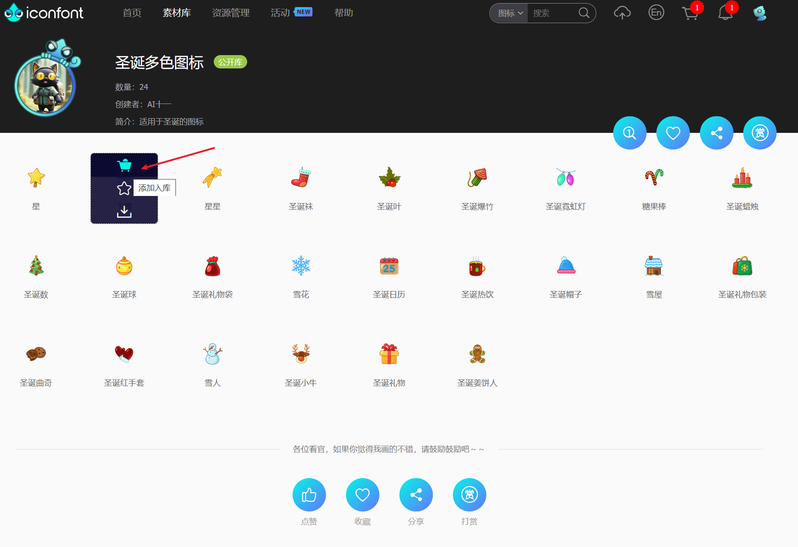

选择完成后，点击导航栏的购物车图片，点击添加至项目。选择要添加的项目，点击确定按钮，自动导航到资源管理页面，在这里可以看到你添加的图标。

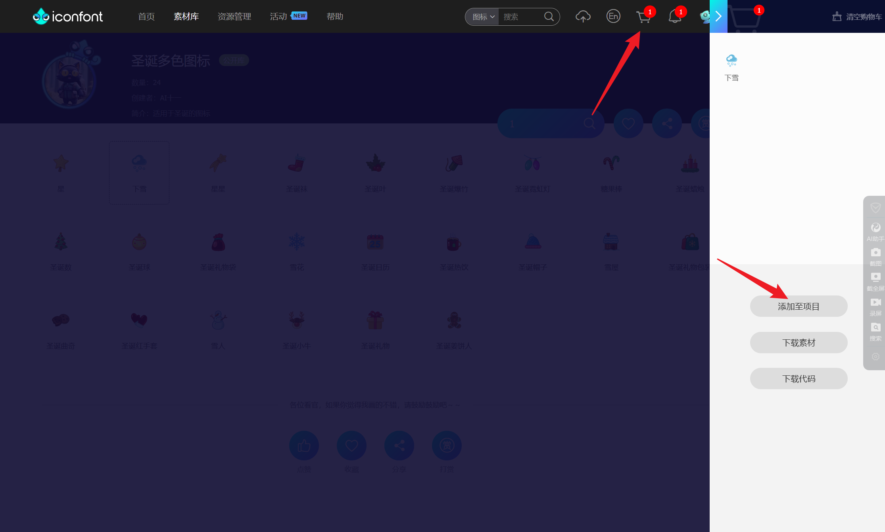

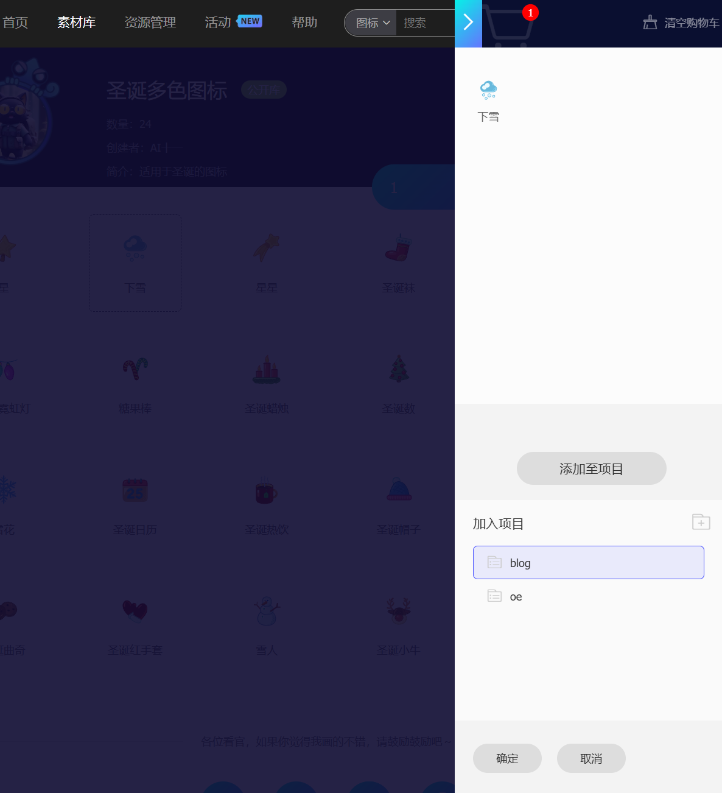

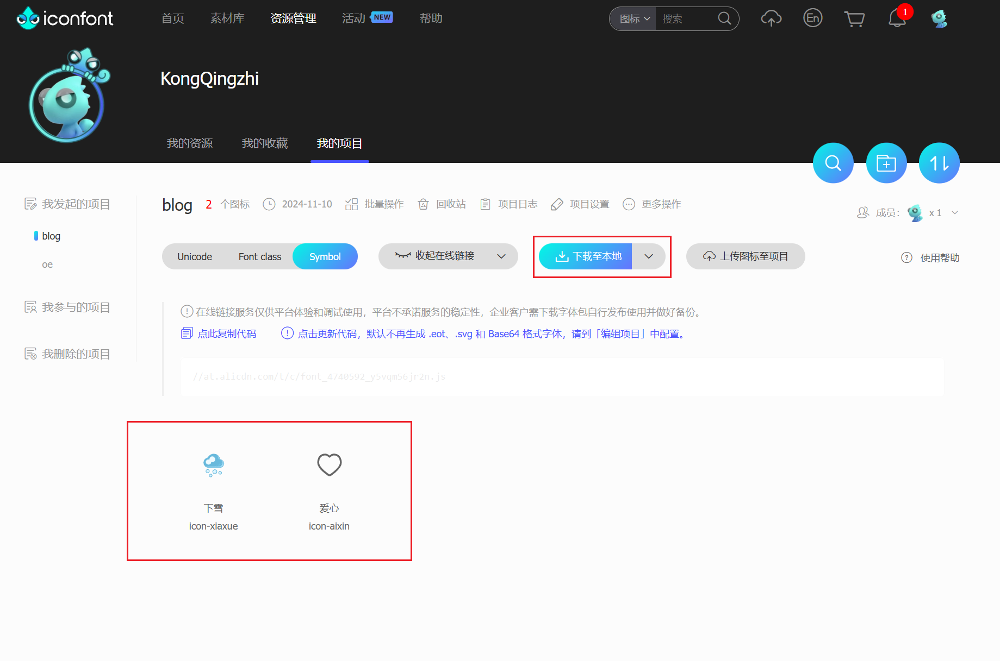

点击下载至本地按钮，下载图标文件并解压。其中，`demo.css` 和 `demo_index.html` 文件是官方生成的示例文件，向你介绍如何使用字体图标。在导入资源文件时可以忽略这两个文件。

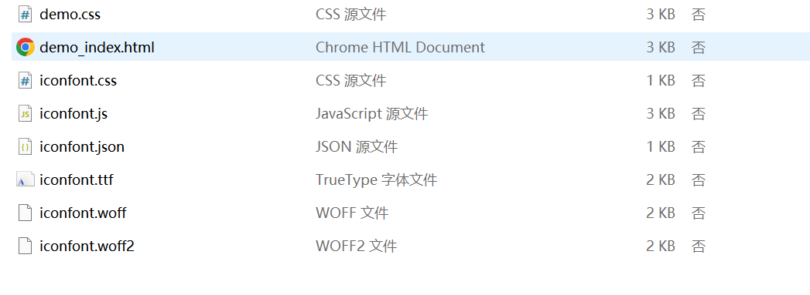

## 使用

打开 `demo_index.html` 文件，这里介绍了三种使用方式。

### Unicode

Unicode 是字体在网页端最原始的应用方式，特点是：

支持按字体的方式去动态调整图标大小，颜色等等。
默认情况下不支持多色，直接添加多色图标会自动去色。
注意：新版 iconfont 支持两种方式引用多色图标：SVG symbol 引用方式和彩色字体图标模式。（使用彩色字体图标需要在「编辑项目」中开启「彩色」选项后并重新生成。）

Unicode 使用步骤如下：

1. 在资源目录下新增一个 `icofont` 的文件夹，将解压后的文件，除了 `demo.css` 和 `demo_index.html` 外的文件全部复制到该文件夹下。

2. 可以在 main.ts 中引入字体文件，或者在 `index.html` 中引入字体文件。

::: code-group

```ts [main.ts]
import '@/assets/iconfont/iconfont.css';
```

```html [index.html]
<link rel="stylesheet" href="./iconfont.css" />
```

:::

3. 挑选相应图标并获取字体编码，应用于页面

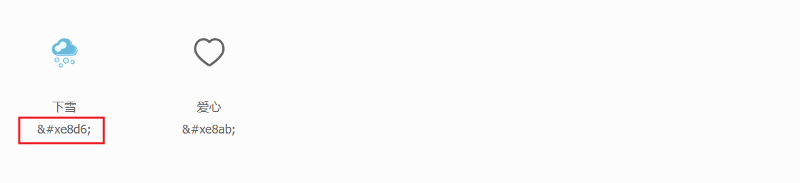

```html
<span class="iconfont">&#xe8d6;</span>
```

Unicode 的方式没有明确的语义，不利于区分图标，所以不推荐使用这种方式。

### Font-class

font-class 是 Unicode 使用方式的一种变种，主要是解决 Unicode 书写不直观，语意不明确的问题。相比于 Unicode 语意明确，书写更直观。可以很容易分辨这个 icon 是什么。

因为使用 class 来定义图标，所以当要替换图标时，只需要修改 class 里面的 Unicode 引用。
使用步骤如下：

1. 在资源目录下新增一个 `icofont` 的文件夹，将解压后的文件，除了 `demo.css` 和 `demo_index.html` 外的文件全部复制到该文件夹下。

2. 可以在 main.ts 中引入字体文件，或者在 `index.html` 中引入字体文件。

::: code-group

```ts [main.ts]
import '@/assets/iconfont/iconfont.css';
```

```html [index.html]
<link rel="stylesheet" href="./iconfont.css" />
```

:::

3. 挑选相应图标并获取字体编码，应用于页面

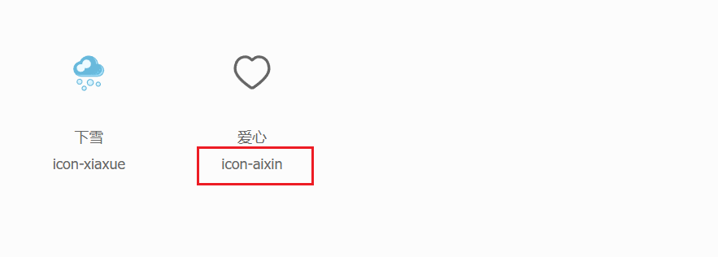

```html
<span class="iconfont icon-aixin"></span>
```

在引入文件时基本与 Unicode 相同，只是使用方式有所不同。

### Symbol（推荐）

这是一种全新的使用方式，应该说这才是未来的主流，也是平台目前推荐的用法。与另外两种相比具有如下特点：

- 支持多色图标了，不再受单色限制。
- 通过一些技巧，支持像字体那样，通过 font-size, color 来调整样式。
- 兼容性较差，支持 IE9+，及现代浏览器。
- 浏览器渲染 SVG 的性能一般，还不如 png。

使用步骤如下：

1. 引入

**引入本地资源：**：
在资源目录下新增一个 `icofont` 的文件夹，将 `iconfont.js` 文件复制到该文件夹下。 在 `index.html` 文件中引入 Iconfont 的 JS 文件：

```html
<script type="module" src="/src/assets/iconfont/iconfont.js"></script>
```

**引入在线资源：**：
在 `index.html` 文件中引入 Iconfont 的在线 JS 文件：

点击查看在线链接按钮，复制链接，在 `index.html` 文件中引入 Iconfont 的 JS 文件：

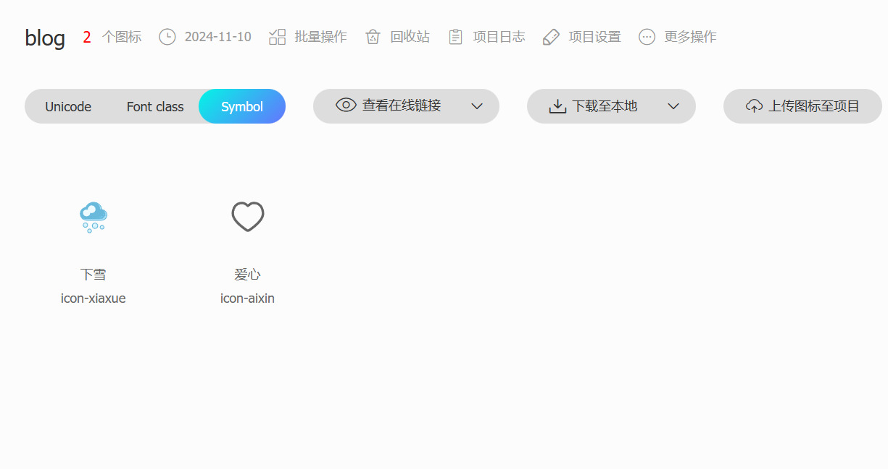

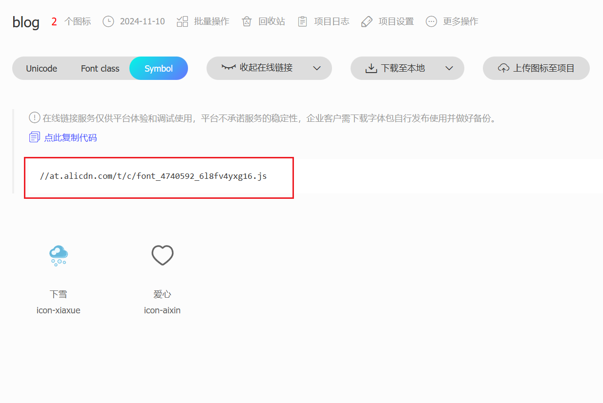

```html
<script src="//at.alicdn.com/t/c/font_4740592_6l8fv4yxg16.js"></script>
```

> [!WARNING]
> 引入本地资源时如果控制台报错：
>
> :x: Uncaught SyntaxError: Cannot use import statement outside a module (at iconfont.js?t=xxxx)
>
> 应该检查script标签中是否添加 `type="module"`

2. 在 `style.css` 加入通用 CSS 代码 （引入一次就行）：

::: code-group

```css [style.css]
.icon {
  width: 1em;
  height: 1em;
  vertical-align: -0.15em;
  fill: currentColor;
  overflow: hidden;
}
```

:::

3. 挑选相应图标并获取类名，应用于页面。


```html
<svg class="icon" aria-hidden="true">
  <use xlink:href="#icon-aixin"></use>
</svg>
```

成功引入，如下所示：

<svg class="icon" aria-hidden="true">
  <use xlink:href="#icon-aixin"></use>
</svg>

> [!tip]
> 由于生成的 svg 默认是有颜色填充的，需要在下载之前对图标进行去色处理。
>
> 点击批量操作按钮，全选图标，然后点击去色按钮，即可全部去色。


## 更新图标

当我们向图标库中添加图标时，需要更新引用资源才能使用。由于引入方式的不同更新图标也是有所不同的。

### Unicode 或者 Font-class

当我们需要更新图标库时，需要资源管理，重复下载步骤，将字体文件替换到 `icofont` 的文件夹下。相对而言比较麻烦。

### Symbol

当我们需要更新图标库时，需要资源管理，点击查看在线链接。

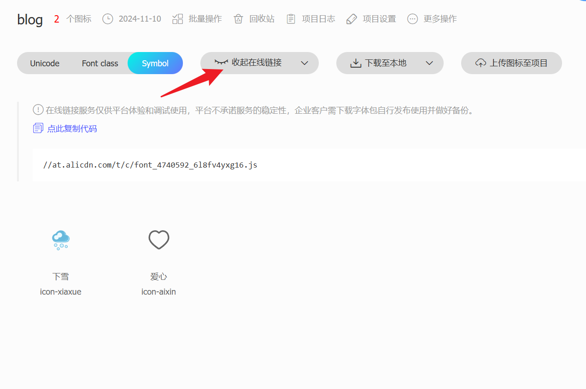

- 引用本地 js

访问生成的链接，将页面代码替换到本地的 `iconfont.js` 文件的代码即可。

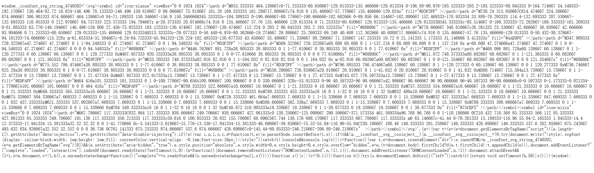

- 引用在线 js

复制生成的在线链接，替换 `index.html` 文件中图标地址即可。

```html
<script src="//at.alicdn.com/t/c/font_4740592_6l8fv4yxg16.js"></script>
```

## 封装组件

为了提高使用 symbol 方式的便捷性，我们特别封装了一个组件。该组件不仅支持传入图标名称，还允许用户自定义图标的颜色和大小，从而满足更多样化的展示需求。

```vue
<template>
  <svg
    class="icon"
    aria-hidden="true"
    :style="{ width: size, height: size, color: color }"
  >
    <use :xlink:href="`#icon-${name}`" />
  </svg>
</template>

<script setup lang="ts">
import { defineOptions } from 'vue';
defineProps({
  color: {
    type: String,
  },
  name: {
    type: String,
    required: true,
  },
  size: {
    type: String,
  },
});
</script>
```
