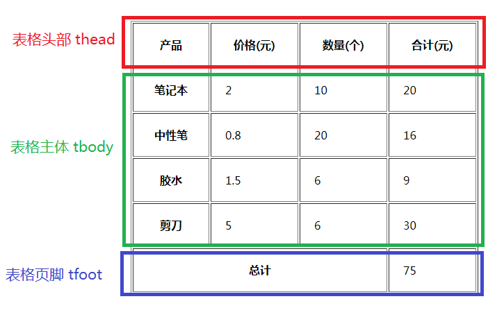

# HTML 基础

## 初识 HTML

### HTML 发展历史


- **_GML_** ：是第一代标记语言，使文档能明确将标示和内容分开，所以文件使用同样的标示方法。

- **_SGML_**： **标准通用标记语言**（ Standard Generalized Markup Language ） ， 是1986年出版发布的一个信息管理方面的国际标准。该标准定义独立于平台和应用的文本文档格式，索引和链接信息，为用户提供一种类似于语法的机制，用来定义文档的结构和指示文档结构的标签（tag）。制定SGML的基本思想是把文档内容与样式分开 。 SGML规定了在文档中嵌入描述标记的标准格式，指定了描述文档结构的标准方法 。

  > - 一个典型的文档可被分为3个层次：结构，内容，样式。SGML主要是处理结构和内容之间的关系。
  > - **结构**：为了描述文档的结构，SGML定义了一个称为“文档类型定义（Document Type Definition,DTD）”的文件，它为组织文档的文档元素（例如章和章标题，节和主题等）提供了一个框架。此外，DTD还为文档元素之间的相互关系指定了规则。例如，“章的标题必须是在章开始之后的第一个元素”，“每个列表至少要有两个项目”等。DTD定义的这些规则可以确保文档的一致性。
  > - **内容**：这里指的内容就是信息本身。内容包括信息名称（标题）、段落、项目列表和表格中的具体内容，具体的图形和声音等。确定内容在DTD结构中的位置的方法称为“加标签”，而创建SGML文档实际上就是围绕内容插入相应的标签。这些标签就是给结构中的每一部分的开始和结束做标记。
  > - **样式**：SGML本身正在定义样式（style）的设置标准，即文档样式语义学和规范语言（Document Style Semantics and Specification Language，DSSSL）。

  SGML 因太严谨规范达500多页，故而不易学、不易用、难以实现，所以在它的基础上又发展出了其他的更易用的置标语言。

- **_HTML_**：**超文本标记语言**（英语：Hyper Text Markup Language），是一种用于创建网页的标准标记语言。主要是通过**HTML标签**对网页中的文本、图片、声音等内容进行描述。

```html
<strong>我是加粗的文本</strong>
```

- **_XML_**： **可扩展的标识语言**（eXtensible Markup Language） , XML 也是 SGML 的一个子集，但使用比较严格的模式

- **XHTML** 的出现是因为HTML扩充性不好，内容的表现跟不上时代的变化（如无法表示某些化学符号等），以及因为性能的问题，官方逐渐趋于严格的模式，所以使用 XML 的严格规则的 XHTML 成了 W3C 计划中 HTML 的替代者。

> [!TIP]
>
> 1.  现在说的 HTML 一般指 HTML 4.01 ， HTML 5 则是 HTML 的第五个修订版，其主要的目标是将互联网语义化，以便更好地被人类和机器阅读，并同时提供更好地支持各种媒体的嵌入。而HTML5本身并非技术，而是标准。它所使用的技术早已很成熟，国内通常所说的html5实际上是html与css3及JavaScript和api等的一个组合
> 2.  html 4.01基于SGML，需要声明DTD。
> 3.  html5不基于SGML，所以不需要引用DTD。

### HTML骨架格式

在 VSCode 中，新建空的 html 文件，输入英文 ! ，回车即可生成 html 骨架

```html
<!doctype html>
<html lang="en">
  <head>
    <meta charset="UTF-8" />
    <meta name="viewport" content="width=device-width, initial-scale=1.0" />
    <title>Document</title>
  </head>
  <body></body>
</html>
```

- **html标签**：所有html中标签的一个根节点

- **head标签**：用于存放title、meta、base、style、script、link，注意**必须设置title标签**

- **title标签**：让页面拥有一个属于自己的标题

- **body标签**：页面的主体部分，用于存放所有的html标签：a、p、h、div、span、img...

### HTML标签分类

在HTML页面中，带有“**<>**”符号的元素被称为HTML标签，如\<html>、\<body>都是HTML标签。

#### 双标签

```html
<标签名>内容</标签名>
```

语法中“<标签名>”表示该标签的作用开始，一般称为开始标(start tab),“</标签名>”表示该标签的作用结束，一般称为结束标签。如下：

```html
<div>我是div</div>
```

双标签中可以再嵌套其它标签，也可以嵌套内容​

#### 单标签

```html
<标签名 />
```

单标签也称为空标签，是指用一个标签符号即可完整的描述某个功能的标签。如下：

```html
<br />
<hr />

```

单标签只能有属性，不能嵌套其他标签及内容

#### HTML标签关系

标签的相互关系就分为两种：嵌套、并列。

- **嵌套关系：父子关系**

```html
<div>
  <p></p>
</div>
```

- **并列关系：兄弟关系**

```html
<div></div>
<p></p>
```

## 常用标签

### 骨架标签

```html
<!doctype html>
<html lang="en">
  <head>
    <meta charset="UTF-8" />
    <meta name="viewport" content="width=device-width, initial-scale=1.0" />
    <title>Document</title>
  </head>
  <body></body>
</html>
```

- **<!DOCTYPE>**: 标签位于文档的最前面，用于向浏览器说明当前文档使用哪种 HTML 或 XHTML 标准规范，必须在文档开头使用 `<!DOCTYPE>` 标签为所有的HTML文档指定版本和类型，只有这样浏览器才能按指定的文档类型解析。DOCTYPE 声明是不区分大小写的。

- **html**: `<html>` 标签告知浏览器这是一个 HTML 文档，是HTML 文档中最外层的元素。`<html>` 标签是所有其他 HTML 元素（除了 <!DOCTYPE> 标签）的容器。`lang` 属性指定了该网页的语言，常用的`en`、`zh-CN`。

- **meta**: `<meta>` 标签提供了 HTML 文档的元数据。元数据不会显示在客户端，但是会被浏览器解析。META元素通常用于指定网页的描述，关键词，文件的最后修改时间，作者及其他元数据。元数据可以被使用浏览器（如何显示内容或重新加载页面），搜索引擎（关键词），或其他 Web 服务调用。`charset` 指定使用的字符集，方便计算机存储和识别各种文字(必须写)。
  > [!TIP]
  >
  > - UTF-8：是目前最常用的字符集编码方式，包含了全世界所有国家需要用到的字符
  > - GB2312：简单中文，包括6763个汉字
  > - BIG5：繁体中文，港澳台等用
  > - GBK：包含全部中文字符，是GB2312的扩展，加入了对繁体字的支持，兼容GB2312

### 标题标签

为了使网页更具有语义化，我们经常会在页面中用到标题标签，HTML提供了6个等级的标签，即：h1、h2、h3、h4、h5、h6。

**标题标签语义**：作为标题使用，并且依据重要性递减。

**特点**：

- 加了标题的文字会加粗，字号会变大
- 每个标题独占一行

```html
<h1></h1>
<h2></h2>
<h3></h3>
<h4></h4>
<h5></h5>
<h6></h6>

<!--需要注意的是：h1标签因为重要，尽量少用。h1大多都是给logo/title使用-->
```

### 段落标签

在网页中要把文字有条理的显示出来，离不开段落标签，可以将整个网页的内容分为若干个段落标签。

**标题标签语义**：把HTML文档分为若干段。

**特点**：

- 文本会根据浏览器窗口大小自动换行
- 段落与段落之间会有一定的空隙
- 标签内不允许再嵌套 `p` 标签

```html
<p>我是一个段落</p>
```

### 水平线标签

在网页中会经常看到一些水平线将段落与段落之间隔开，使得文档结构清晰，层次分明。这些水平线可以通过插入图片实现，也可以简单的通过标记来完成。**hr** 就是创建横跨网页水平线的标记。

**标题标签语义**：分割线。

**特点**：

- 单标签

```html
<hr />
```

### 换行标签

在HTML中，一个段落中的文字会从左到右依次排列，直到浏览器窗口的右端才会自动换行。如果希望某段文本强制换行显示，就需要使用换行标签。

**标题标签语义**：强制换行。

**特点**：

- 单标签
- 是另起一行，与段落不同，行与行之间无空隙

```html
<br />
```

### div span标签

`div`、`span`是没有语义的，是网页布局中主要的2个盒子。`div`是division的缩写，表示分割、分区的意思.`span`表示跨度、跨距、范围。

**特点**：

- div 标签用来布局，但是一行只能放一个，大盒子
- span 标签用来布局，一行上可以有多个，小盒子

```html
<div>这是div</div>
<span>这是span</span>
```

### 文本格式化标签

| 标签                          | 显示效 果                                      |
| :---------------------------- | :--------------------------------------------- |
| \<b>\</b> \<strong>\</strong> | 文字以粗体方式显示（XHTML之后推荐使用strong）  |
| \<i>\</i> \<em>\</em>         | 文字以斜体方式显示（XHTML之后推荐使用em）      |
| \<s>\</s> \<del>\</del>       | 文字以加删除线方式显示（XHTML之后推荐使用del） |
| \<u>\</u> \<ins>\</ins>       | 文字以加下划线方式显示（XHTML之后不赞成使用u） |

b、i、s、u 没有强调的意思，strong、em、del、ins语义更强烈，有强调的意思。

### 图像标签

HTML网页中任何元素的实现都要依靠HTML标签，要想在网页中显示图像就需要使用图像标签。

```html

<!-- src属性用于指定图像文件的路径和文件名，是必须的属性 -->
```

| 属性   | 属性值                    | 描述                     | 是否必须 |
| ------ | ------------------------- | ------------------------ | -------- |
| src    | url                       | 图像的路径               | 是       |
| alt    | 文本                      | 图像不能显示时的替换文本 | 否       |
| title  | 文本                      | 鼠标悬停时显示的内容     | 否       |
| width  | 像素（XHTML不支持百分比） | 设置图像的宽度           | 否       |
| height | 像素（XHTML不支持百分比） | 设置图像的高度           | 否       |
| border | 数字                      | 设置图像边框的宽度       | 否       |

**路径**：

- 目录文件夹：普通文件夹，存放相关素材，HTML文件、图片等。
- 根目录：打开文件夹的第一层就是根目录。
- 路径：相对路径和绝对路径。
- 相对路径：包含同一级路径，下一级路径，上一级路径。
- 绝对路径：指目录下的绝对位置，通常是从盘符开始的路径

```html
 //同一级路径  //下一级路径
/  //上一级路径 ../
 // 电脑绝对地址
 // 网络绝对地址
```

### 链接标签

超链接标签，从一个页面链接到另一个页面。在HTML中创建超链接非常简单，只需要用标签将链接对象环绕即可。

```html
<a href="跳转目标" target="目标窗口的弹出方式">链接的文本或图像</a>
```

- **href**：用于指定链接目标的url地址，是Hypertext Reference的缩写，意思是超文本引用。只有使用这个属性，标签才具有链接功能。

- **target**：用于指定链接页面的打开方式，其取值有**\_self**和 **\_blank**两种，self表示在本窗口中打开链接页面，blank表示在新窗口中打开。

**链接的分类：**

1. 外部链接 ：需要添加**http://**的域名，如 `<a href="http://www.baidu.com/">百度</a>`

2. 内部链接：网站内部页面之间的相互链接，直接链接内部页面名称，如`<a href="index.html">内部链接</a>`

3. 空连接：如果当时没有确定链接目标时，通常将链接标签的href属性值定义为“#”（即href=“#”），表示该链接暂时为一个空链接。

4. 下载链接：如果href里面地址是一个文件或者压缩包，会下载这个文件，如`<a href="image.zip">下载图片</a>`

5. 网页元素链接：在网页中各种网页元素，如文本、图像、表格、音频、视频等都可以插入超链接

6. 锚点链接：点击链接，快速定位到页面的相应位置

```html
<h3>外部链接</h3>
<a href="http:\\www.qq.com" target="_self">腾讯</a> 当前窗口打开
<br />
<a href="http:\\www.qq.com" target="_blank">腾讯</a> 新建窗口打开
<h3>内部链接</h3>
<a href="09-图像标签.html" target="_self">10-路径</a> 当前窗口打开
<h3>空链接</h3>
<a href="#" target="_self">空链接</a> 当前窗口打开
<h3>下载链接</h3>
<a href="压缩包.zip" target="_self">下载链接</a> 当前窗口打开
<h3>网页元素链接</h3>
点击图片访问相应的网站
<br />
<a href="http:\\www.baidu.com" target="_self"
  ></a>
<br />当前窗口打开
```

### 锚点链接

通过创建描点链接，用户能够快速定位到目标内容。

创建描点链接分为两步：

1. 在跳转目标的位置添加id名标注
2. 使用<a href="#id名">链接文本</a>

> [!NOTE]
> 不能在a标签里嵌套a标签

```html
<h3>锚点链接</h3>
<a href="#zuoze" target="_self">锚点链接到作者</a>
...内容
<h id="zuoze">作者：孔庆志</h><br />
2020.03.31
```

### base标签

base 单标签，可以设置整体链接打开的状态是以新窗口打开还是在当前窗口中打开。

- target 属性 控制整个页面的链接跳转方式。
- href 基于当前链接地址进行跳转，如果没有基于当前链接则不受影响。

```html
<!doctype html>
<html>
  <head>
    <meta charset="UTF-8" />
    <title></title>
    <base target="_blank" />
  </head>
  <body></body>
</html>
```

### 特殊字符

在 HTML 中不能使用小于号（<）和大于号（>），这是因为浏览器会误认为它们是标签。如果希望正确地显示预留字符，我们必须在 HTML 源代码中使用字符实体（character entities）。

| 特殊字符     | 字符代码   |
| ------------ | ---------- |
| 空格         | `&nbsp;`   |
| <            | `&lt;`     |
| >            | `&gt;`     |
| &            | `&amp;`    |
| ￥           | `&yen;`    |
| ©(版权)     | `&copy;`   |
| ®(注册商标) | `&reg;`    |
| ℃            | `&deg;`    |
| ±            | `&plusmn;` |
| ×            | `&times;`  |
| ÷            | `&divide;` |
| ²            | `&sup2;`   |
| ³            | `&sup3;`   |

### 注释标签

在HTML中还有一种特殊标签——注释标签。如果需要在HTML文档中添加一些便于阅读和理解但又不需要显示在页面中的注释文字，就需要使用注释标签。其基本语法格式如下：

```
<!-- <h3>标题</h3> -->
```

## 列表标签

把一系列的文字及数据制成表，以表显示。容器里面装载着文字或图表的一种形式，叫列表。列表最大的特点是整齐、整洁、有序。

### 无序列表 ul

无序列表的各个列表项之间没有顺序级别之分，是并列的。在 `<ul>` 标签中只能使用 `<li>` 标签,不要使用 `<p>` 标签之类的。但在 `<li>` 标签内可以嵌套其他标签使用。

**特点**：

1. 无序列表的各个列表项之间没有顺序之分，是并列的
2. 在 ul 标签中只能嵌套 li 标签
3. 在 li 标签中可以嵌套其他任何标签
4. 无序列表会带有自己的样式属性，在实际使用时，会用CSS来设置

```html
<ul>
  <li>列表项1</li>
  <li>列表项2</li>
  <li>列表项3</li>
  ……
</ul>
```

### 有序列表 ol

有序列表即为排列顺序的列表，其各个列表项按照一定的顺序排列定义。

**特点**：

1. 在 ol 标签中只能嵌套 li 标签
2. 在 li 标签中可以嵌套其他任何标签
3. 有序列表会带有自己的样式属性，在实际使用时，会用CSS来设置

```html
<ol>
  <li>列表项1</li>
  <li>列表项2</li>
  <li>列表项3</li>
  ……
</ol>
```

所有特性与ul基本一致，但实际开发中，较少使用ol

| 属性                                                             | 值       | 描述                                                                         |
| :--------------------------------------------------------------- | :------- | :--------------------------------------------------------------------------- |
| [compact](https://www.w3school.com.cn/tags/att_ol_compact.asp)   | compact  | HTML5 中不支持。HTML 4.01 中不赞成使用。规定列表呈现的效果比正常情况更小巧。 |
| [reversed](https://www.w3school.com.cn/tags/att_ol_reversed.asp) | reversed | 规定列表顺序为降序。(9,8,7...)                                               |
| [start](https://www.w3school.com.cn/tags/att_ol_start.asp)       | _number_ | 规定有序列表的起始值。                                                       |
| [type](https://www.w3school.com.cn/tags/att_ol_type.asp)         | 1AaIi    | 规定在列表中使用的标记类型。                                                 |

### 自定义列表

自定义列表常用于对术语或名词进行解释和描述，定义列表的列表项没有任何项目符号。

**特点**：

1. 在 dl 标签中只能嵌套 dt 标签和dd标签
2. dt标签和dd标签数量上没有限制
3. dt标签和dd标签是并列关系

```html
<dl>
  <dt>名词1</dt>
  <dd>名词1解释1</dd>
  ...

  <dt>名词2</dt>
  <dd>名词2解释1</dd>
  <dd>名词2解释2</dd>
  ...
</dl>

<!--
	<dd>是对<dt>进行描述或解释的，一个<dt>可以使用多个<dd>来进行描述
-->
```

## 表格

用于显示、展示数据，让数据更加规整，可读性更好，把繁琐的数据表现得很有条理，表格不是用来布局页面的，而是用来展示数据的。

### 创建表格

```html
<table>
  <tr>
    <td>单元格内的文字</td>
    ...
  </tr>
  ...
</table>
```

- table 用于定义一个表格
- tr 用于定义表格中的一行，必须嵌套在table标签中，在table标签内有几对tr，就有几行表格。
- td 用于定义表格中单元格，必须嵌套在`<tr></tr>`标签中，在tr标签内有几对td，就有几个单元格（列）。

### 表格属性

| 属性名      | 属性值              | 含义                                                  |
| ----------- | ------------------- | ----------------------------------------------------- |
| align       | left、center、right | 规定表格相对周围元素的对齐方式，表格位置              |
| border      | 1或""               | 边框默认为""，无边框。值不能小于1，如果小于1则等同于0 |
| cellpadding | 像素值              | 规定单元边框与文字之间的空白，默认1像素               |
| cellspacing | 像素值              | 规定单元格与单元格之间的空白，默认2像素               |
| width       | 像素值或百分比      | 规定表格宽度                                          |
| height      | 像素值或百分比      | 规定表格高度                                          |

### 表头标签

因为表格可能很长，为了更好的表示表格的语义，可以将表格分割成表格头部和表格主体两大部分。表头一般位于表格的第一行或第一列，其文本加粗居中。设置表头很简单，只需要用`\<th>\</th>`替代相应单元格标签的`\<td>\</td>`即可。

```html
<thead>
  <!--表格头部区域-->
  <tr>
    <th>排名</th>
    <th>关键词</th>
    <th>趋势</th>
  </tr>
</thead>
<tbody>
  <!--表格主体区域-->
  <tr>
    <th>1</th>
    <th>鬼吹灯</th>
    <th>上升</th>
  </tr>
  ...
</tbody>
```

### 表格结构

在使用表格进行布局时，可以将表格划分为头部、主体和页脚，如下所示：



- **`<thead></thead>`**: 用于定义表格的头部，必须位于 `<table></table>` 标签中，一般包含网页的logo和导航等头部信息。
- **`<tbody></tbody>`**: 用于定义表格的主体，位于 `<table></table>` 标签中，一般包含网页中除头部和底部之外的其他内容。
- **`<tfoot></tfoot>`**: 用于定义表格的页脚内容，应该与 `<thead>` 和` <tbody>` 元素结合使用，用来规定表格的各个部分（表头、主体、页脚）。`<tfoot>` 元素内部必须包含一个或多个 `<tr>` 标签。在HTML5中，已不支持tfoot标签的所有属性。

### 表格标题

表格的标题使用 `<caption>` 标签来定义，必须直接定义在 `<table>` 标签之后，并且每个表格只能定义一个标题。通常这个标题会被居中于表格之上。

```html
<table>
  <caption>
    我是表格的标题
  </caption>
</table>
```

<table>
  <caption>我是表格的标题</caption>
  <thead>
    <tr>
      <th>列标题1</th>
      <th>列标题2</th>
      <th>列标题3</th>
    </tr>
  </thead>
  <tbody>
    <tr>
      <td>行1，列1</td>
      <td>行1，列2</td>
      <td>行1，列3</td>
    </tr>
    <tr>
      <td>行2，列1</td>
      <td>行2，列2</td>
      <td>行2，列3</td>
    </tr>
  </tbody>
</table>

### 合并单元格

**合并单元格的方式**：

- 跨行合并（**rowspan** ）：rowspan="合并单元格的个数"
- 跨列合并（**colspan**）：colspan="合并单元格的个数"

**目标单元格（写合并代码）**：

- 跨行合并：最上侧单元格为目标单元格，写合并代码
- 跨列合并：最左侧单元格为目标单元格，写合并代码

**合并步骤**：

1. 先确定跨行还是跨列合并
2. 找到目标单元格,写上合并方式 = '合并单元格的数量'，比如 `<td colspan='2'></td>`
3. 删除多余的单元格

<table>
  <caption>我是表格的标题</caption>
  <thead>
    <tr>
      <th>序号</th>
      <th>名称</th>
      <th>数量</th>
      <th>单价</th>
    </tr>
  </thead>
  <tbody>
    <tr>
      <td>1</td>
      <td>尺子</td>
      <td>1</td>
      <td>5元</td>
    </tr>
    <tr>
      <td>2</td>
      <td>草稿本</td>
      <td>2</td>
      <td>5元</td>
    </tr>
     <tr>
      <td>3</td>
      <td>圆珠笔</td>
      <td>4</td>
      <td>2.5元</td>
    </tr>
  </tbody>
  <tfoot>
    <tr>
      <td colspan="3">合计</td>
      <td>25元</td>
    </tr>
  </tfoot>
</table>

```html
<table>
  <caption>
    我是表格的标题
  </caption>
  <thead>
    <tr>
      <th>序号</th>
      <th>名称</th>
      <th>数量</th>
      <th>单价</th>
    </tr>
  </thead>
  <tbody>
    <tr>
      <td>1</td>
      <td>尺子</td>
      <td>1</td>
      <td>5元</td>
    </tr>
    <tr>
      <td>2</td>
      <td>草稿本</td>
      <td>2</td>
      <td>5元</td>
    </tr>
    <tr>
      <td>3</td>
      <td>圆珠笔</td>
      <td>4</td>
      <td>2.5元</td>
    </tr>
  </tbody>
  <tfoot>
    <tr>
      <td colspan="3">合计</td>
      <td>25元</td>
    </tr>
  </tfoot>
</table>
```

## 表单

收集用户信息，在网页中，与用户进行交互，收集用户信息，此时就需要表单。

HTML中，一个完整的表单由表单控件（也称表单元素）、提示信息和表单域三个部分组成。

- **表单控件**：包含了具体的表单功能项，如单行文本输入框、密码输入框、复选框、提交按钮、重置按钮等。

- **提示信息**：一个表单中通常还需要包含一些说明性的文字，提示用户进行填写和操作。

- **表单域**：相当于一个**容器**，用来容纳所有的表单控件和提示信息，可以通过它定义处理表单数据所用程序的 url 地址，以及数据提交到服务器的方法。如果不定义表单域，表单中的数据就无法传送到后台服务器。

### 表单控件

表单元素就是允许用户在表单中输入或者选择的内容控件。

**`<input />`** 标签为单标签，type属性是其最基本的属性，取值有很多种，用于指定不同的控件类型。除了type属性之外，`\<input />` 标签还可以定义其他的属性，如下表所示：

<table border="1">
    <thead>
        <tr>
            <th>属性</th>
            <th>属性值</th>
            <th>描述</th>
        </tr>
    </thead>
    <tbody>
        <tr>
            <td rowspan="9">type</td>
            <td>text</td>
            <td>单行文本输入框</td>
        </tr>
        <tr>
            <td>password</td>
            <td>密码输入框</td>
        </tr>
        <tr>
            <td>radio</td>
            <td>单选按钮</td>
        </tr>
        <tr>
            <td>checkbox</td>
            <td>复选框</td>
        </tr>
        <tr>
            <td>button</td>
            <td>普通按钮</td>
        </tr>
        <tr>
            <td>submit</td>
            <td>提交按钮</td>
        </tr>
        <tr>
            <td>reset</td>
            <td>重置按钮</td>
        </tr>
        <tr>
            <td>image</td>
            <td>图像形式的提交按钮</td>
        </tr>
        <tr>
            <td>file</td>
            <td>文件域</td>
        </tr>
        <tr>
            <td>name</td>
            <td>用户自定义</td>
            <td>控件的名称</td>
        </tr>
        <tr>
            <td>value</td>
            <td>用户自定义</td>
            <td>Input控件中的默认文本值</td>
        </tr>
        <tr>
            <td>size</td>
            <td>正整数</td>
            <td>Input控件在页面中的显示宽度</td>
        </tr>
        <tr>
            <td>checked</td>
            <td>checked</td>
            <td>定义选择控件默认被选中的项</td>
        </tr>
        <tr>
            <td>maxlength</td>
            <td>正整数</td>
            <td>控件允许输入的最大字符数</td>
        </tr>
    </tbody>
</table>

#### 单行文本输入框

单行文本输入框通过 `<input type="text">` 标签来设定，当用户要在表单中键入字母、数字等内容时，就会用到单行文本输入框。

```html
<form>
  First name: <input type="text" name="firstname" /><br />
  Last name: <input type="text" name="lastname" />
</form>
```

#### 密码字段

密码字段通过标签 `<input type="password">` 来定义:

```html
<form>Password: <input type="password" name="pwd" /></form>
```

**注意**：密码字段字符不会明文显示，而是以星号或圆点替代。

#### 单选按钮

`<input type="radio">` 标签定义了表单单选框选项，通过同一个name值定义同一个组

```html
<form>
  <input type="radio" name="sex" value="male" />Male<br />
  <input type="radio" name="sex" value="female" />Female
</form>
```

- name属性定义了表单中所有单选按钮的组名，同一组的单选按钮只能选中其中一个
- value属性定义了单选按钮的值

#### 复选框

`<input type="checkbox">` 定义了复选框. 用户需要从若干给定的选择中选取一个或若干选项。

```html
<form>
  <input type="checkbox" name="vehicle" value="Bike" />I have a bike<br />
  <input type="checkbox" name="vehicle" value="Car" />I have a car
</form>
```

#### 普通按钮

通过 `<input type="button">` 来定义

```html
<form>
  <input type="button" value="点我" />
</form>
```

#### 提交按钮

`<input type="submit">` 定义了提交按钮.

当用户单击确认按钮时，表单的内容会被传送到另一个文件。表单的动作属性定义了目的文件的文件名。由动作属性定义的这个文件通常会对接收到的输入数据进行相关的处理。:

```html
<form>
  Username: <input type="text" name="user" /><br />
  <input type="submit" value="提交" />
</form>
```

#### 重置按钮

`<input type="reset">` 定义了重置按钮.

```html
<form>
  Username: <input type="text" name="user" /><br />
  <input type="reset" value="重置" />
</form>
```

#### 图像按钮

`<input type="image">` 定义了图像按钮，表示按钮可以用图片来显示，用src指定图片的路径

```html
<form>
  <input type="image" src="logo.png" />
</form>
```

#### 文件域

`<input type="file">` 定义了文件域，点击按钮可以选择上传的文件

```html
<form>
  <input type="file" />
</form>
```

### label标签

`<label>` 标签为 input 元素定义标注（标记）。

作用：用于绑定一个表单元素，当点击label标签时，被绑定的表单元素就会获得输入焦点，增加用户体验。

如何绑定？ `<label>` 标签的 **for 属性**用于绑定表单元素，只需要指定for属性的值与被绑定表单元素的**id值**相同即可。

```html
<form>
  <label for="username">用户名：</label>
  <input
    type="text"
    name="user name"
    id="username"
    value="请输入用户名"
  /><br />
  <label for="gender1">男</label>
  <input type="radio" name="gender" id="gender1" />
  <label for="gender2">女</label>
  <input type="radio" name="gender" id="gender2" />
</form>
```

### textarea控件

如果需要输入大量的文本信息，就需要使用 `<textarea></textarea>` 标签，常见于留言板、评论等。通过textarea控件可以轻松的创建多行文本输入框，其基本语法格式如下：

```html
<form>
  <textarea
    cols="每行中的字符数"
    rows="显示的行数"
    placeholder="期待你的神评论"
  ></textarea>
</form>
```

### 下拉菜单

使用 select 控件定义下拉菜单，基本语法格式如下：

```html
<form>
  <label for="username">用户名：</label>
  <input
    type="text"
    name="user name"
    id="username"
    value="请输入用户名"
  /><br />
  <label for="gender1">男</label>
  <input type="radio" name="gender" id="gender1" />
  <label for="gender2">女</label>
  <input type="radio" name="gender" id="gender2" />
</form>
```

- select标签中至少应包含一对option标签
- 在option标签中加入selected="selected"属性时，表示当前项为默认选中项

### 表单域

在HTML中，form 标签被用于定义表单域，即创建一个表单，以实现用户信息的收集和传递，form 中所有内容都会被提交给服务器。基本语法格式如下：

```html
<form>
  <!-- text文本框 -->
  用户名：<input type="text" /><br />
  <!-- password密码框 看不见内容 -->
  密码：<input type="password" /><br />
  <!-- radio单选按钮 多选一-->
  性别：男<input type="radio" /> 女<input type="radio" /><br />
  <!-- checkbook复选按钮 多选-->
  爱好：书法<input type="checkbox" /> 吉他<input type="checkbox" /> 音乐<input
    type="checkbox"
  /><br />
  <!-- submit提交按钮 提交按钮会把表单数据发送给服务器 -->
  <input type="submit" value="免费注册" /><br />
  <!-- reset重置按钮 重置按钮会清除表单中的所有数据 -->
  <input type="reset" value="重新填写" /><br />
  <!-- button按钮 定义可点击按钮（多数情况下，用于通过JavaScript启动脚本） -->
  <input type="button" value="获取验证码" /><br /><br />
  <!-- file 定义输入字段和“浏览”按钮，供上传文件 -->
  上传文件：<input type="file" value="浏览" /><br /><br />
</form>
```

**常用属性**：

- action：在表单收集到信息后，需要将信息传递给服务器进行处理，action属性用于指定接收并处理表单数据的服务器程序的url地址。

- method：用于设置表单数据的提交方式，取值为get与post。

- name：用于指定表单的名称，以区分同一个页面中的多个表单。

## html5 新增

### 语义化标签

在 html5 中新增了一些具有语义化的标签，这些标签主要是为了提高代码的可读性，让开发者更加清晰地看出页面的结构。

- **header**：定义文档的头部区域

- **nav**：定义导航链接的部分

- **footer**：定义section或document的页脚

- **article**：定义页面独立的内容区域

- **section**：定义文档的节（section、区段）

- **aside**：定义页面的侧边栏内容

```html
<header>定义网页的头部 页眉</header>
<nav>定义导航链接部分</nav>
<footer>定义网页的底部 页脚</footer>
<article>定义文章</article>
<section>定义区域</section>
<aside>定义侧边栏</aside>
```


- **datalist**：定义选项列表，与input结合使用

```html
<!-- input使用list属性 -->
<input type="text" value="输入明星" list="star" />
<!-- datalist使用id属性，list属性与id属性的值一致，表示与input形成链接 -->
<datalist id="star">
  <option>张学友</option>
  <option>张韶涵</option>
  <option>张敬轩</option>
  <option>孙燕姿</option>
  <option>孙悦</option>
  <option>张碧晨</option>
</datalist>
```

### fieldset

可将表单内的相关元素分组打包，与legend搭配使用

```html
<fieldset>
  <legend>登录页面</legend>
  <!--  外边框的标题 -->
  用户名：<input type="text" /><br /><br />
  密　码：<input type="password" />
</fieldset>
```

### mark

用于定义带有记号的文本。在需要突出显示文本时可使用 `<mark>` 标签。

```html
<p>这是一个段落，中间的<mark>文本</mark>需要标记</p>
```

注意：IE 8及之前的版本不支持mark标签。

### meter

定义度量衡，仅用于已知最大和最小值的度量。比如：磁盘使用情况，查询结果的相关性等。**不能当做进度条使用**。

- min：规定范围最小值
- max：规定范围最大值
- value：规定度量的当前值，是**必须的属性**。可以用**数值**表示
- low：范围界定的最低值
- high：范围界定的最大值

注意：IE浏览器不支持meter标签。

<meter min="0" max="10" value="6"></meter> <br>
<meter min="0" max="100" value="95" low="30" high="90"></meter><br>
<meter min="0" max="100" value="60" low="30" high="90"></meter><br>
<meter min="0" max="100" value="25" low="30" high="90"></meter>

```html
<meter min="0" max="10" value="6"></meter> <br />

<!-- value的值超过high的值 -->
<meter min="0" max="100" value="95" low="30" high="90"></meter><br />

<!-- value的值在low与high之间 -->
<meter min="0" max="100" value="60" low="30" high="90"></meter><br />

<!-- value的值低于low的值 -->
<meter min="0" max="100" value="25" low="30" high="90"></meter>
```

### progress

定义运行中的任务进度，通常与JavaScript结合使用来显示当前的任务进度。不能作为度量值使用

```html
<progress value="20" max="100"></progress>
```

### 新增的input type属性值

| 类型            | 使用示例                  | 含义                                  |
| --------------- | ------------------------- | ------------------------------------- |
| **email**       | `<input type="email"> `   | 输入邮箱格式，如：xx@163.com          |
| **url**         | `<input type="url"> `     | 输入url格式，如：http://www.baidu.com |
| **number**      | `<input type="number"> `  | 输入数字格式，只能是数字              |
| **search**      | `<input type="search"> `  | 搜索框                                |
| **range**       | `<input type="range">`    | 自由拖动滑块                          |
| **time**        | `<input type="time">`     | 小时分钟                              |
| **date**        | `<input type="date">`     | 年月日                                |
| **datetime**    | `<input type="datetime">` | 时间                                  |
| **month**       | `<input type="month">`    | 年月                                  |
| **week**        | `<input type="week">`     | 星期 年                               |
| **color**       | `<input type="color">`    | 颜色                                  |
| **hidden/show** | `<input type="hidden">`   | 定义表单隐藏/显示                     |

```html
<form action="">
  邮箱：<input type="email" /><br /><br />
  url： <input type="url" /><br /><br />
  数字：<input type="number" /><br /><br />
  搜索：<input type="search" /><br /><br />
  滑块：<input type="range" /><br /><br />
  时分：<input type="time" /><br /><br />
  年月日：<input type="date" /><br /><br />
  年月：<input type="month" /><br /><br />
  星期：<input type="week" /><br /><br />
  颜色：<input type="color" /><br /><br />
  <input type="submit" />
</form>
```

hidden/show属性的使用：

```html
<script type="text/javascript">
  var flag = true;
  function hide() {
    var input = document.getElementById('myinput');
    var btn = document.getElementById('btn');
    if (flag) {
      input.type = 'hidden';
      btn.innerHTML = '显示';
      flag = false;
    } else {
      input.type = 'show';
      btn.innerHTML = '隐藏';
      flag = true;
    }
  }
</script>

<button id="btn" onclick="hide()">隐藏</button><br />
<input id="myinput" name="myinput" type="show" value="小明" />
```

### 常用新属性

| 属性             | 用法                                              | 含义                                                                                                                                            |
| ---------------- | ------------------------------------------------- | ----------------------------------------------------------------------------------------------------------------------------------------------- |
| **placeholder**  | `<input type="text" placeholder="请输入用户名" >` | **占位符** 用于提示用户输入，当用户输入数据时，提示信息会自动消失                                                                               |
| **autofocus**    | `<input type="text"   autofocus>`                 | 规定当页面加载时input元素应该自动获得焦点                                                                                                       |
| **multiple**     | `<input type="file" multiple>`                    | 多文件上传                                                                                                                                      |
| **autocomplete** | `<input type="text" autocomplete="off"> `         | 规定表单是否应该启用自动完成功能，有两个值分别是on和off，on表示记录已经输入的值 。条件是：1.autocomplete首先需要提交按钮 2.这个表单必须给name值 |
| **required**     | `<input type="text" required>`                    | 必填项，内容不能为空                                                                                                                            |
| **accesskey**    | `<input type="text" accesskey="s"> `              | 规定激活（使元素获得焦点）元素的快捷键，采用alt+字母的形式                                                                                      |

```html
<form action="">
  用户名：
  <input type="text" placeholder="请输入用户名" autofocus /><br />
  上传头像：
  <input type="file" multiple /><br />
  姓名：
  <input type="text" autocomplete name="username" /><br />
  昵称：
  <input type="text" required accesskey="s" /><br />
  <input type="submit" />
</form>
```
